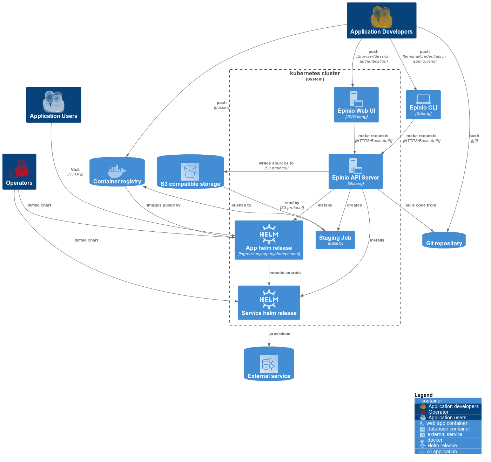

# Epinio architecture

This page describes the Epinio architecture using [the C4 model](https://c4model.com/).

## Generating the architecture diagram

- Navigate to the directory where the `puml` file is stored (e.g. [here](https://github.com/epinio/epinio/blob/main/docs/explanations/architecture/containers.puml))
- Download a released plantuml jar from here (`v1.2022.6` is known to work): https://github.com/plantuml/plantuml/releases
- Generate the diagram with a command like:

```
java -jar plantuml-1.2022.6.jar containers.puml
```

## Epinio architecture

__"Containers" diagram in c4model__



## Useful links

- [c4 model](https://c4model.com/)
- [C4-PlantUML](https://github.com/plantuml-stdlib/C4-PlantUML)
