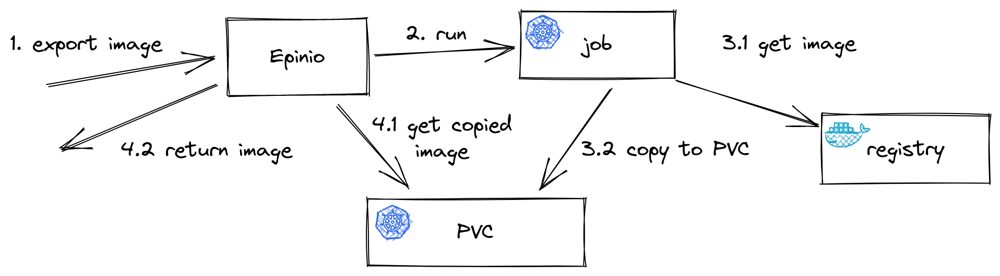

# Application image export

The `epinio app export` command provides the ability to retrieve all parts of an application (the helm chart, its values and the container image) and save them in the local filesystem.

The [`skopeo`](https://github.com/containers/skopeo) cli is used to download the image from the registry. This was chosen over the standard `docker` cli because it doesn't need a demon to run, nor does it require root for most of its operations, and it is OCI compliant.

When a client requests the export of the image of an application from the Epinio server, the server first executes a Kubernetes job. This job runs the `skopeo copy` command that fetches the image from the registry. The image is stored on the PVC shared with the Epinio server. Once downloaded the image is served to the client that requested it.

Cleanup is done only if all the operations succeeded. The job will be not removed if some error occurs, to keep the logs for further investigations.

