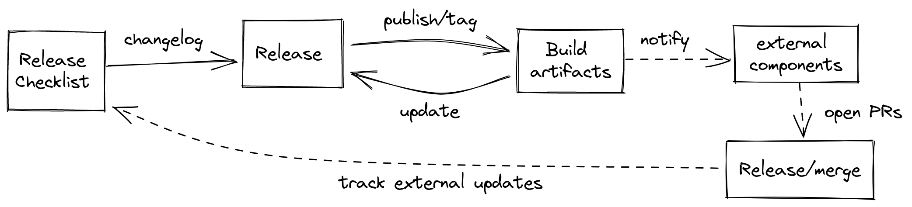

# Epinio release flow

During the last release we have faced some issues, and we would like to have a smoother process.  
This is a RFC to see which could be the best release process.

## Automation

Since we are using tags to define the releases then the tagging action should be starting point.  
We could use different tags to define nightly builds and release candidates.

Ideally all the steps should be automated, awaiting for a final check.  

## Overview

This is an overview of the release process. In the next sections we are going to detail it a bit more.

Everyone MUST be able to do a release. We could eventually enforce this practice switching person (this is called sometimes the "Release Captain").

Every release needs to have a Release Notes. This is the entrypoint. A Release Draft will be already available, automatically generated from the merged PR, issues and labels (releasedrafter?). We should be careful about labeling issues/PRs and use clear titles, to avoid confusions while preparing the Release Notes. The publishing of the Release Notes will tag the repository and will start the release process. The artifacts will be built and added to the Release. If there are other components that needs to be notified about the update, then automated PRs should be opened (updatecli?), and added in the Release Checklist as comments, so we could track the progress of them.

## Components

Epinio is made up of two main components: the `epinio` binary (the CLI and the server backend) and the `epinio-ui`.
The Helm charts are the supported and suggested way to deploy Epinio.  

### Epinio

The Epinio repository is the main one. It contains the code regarding the server and the `epinio` CLI.

### Epinio UI

The Epinio UI is made up of the `ui-backend` and the `dashboard`. The first one is a proxy for the JS frontend, that is a component that is reused in the Rancher dashboard as well.

## Release

The Epinio server and the Epinio UI releases could diverge. A fix or improvement on only one component should be possible.
Also the Helm charts could not be aligned with the Epinio or Epinio UI releases. An external dependency could be updated without the need of updating the Epinio components.

After the merge of a PR in the main branch a draft of the Release Changelog will be prepared.  
When we are ready to make a release we can __manually__ check and edit the Release Notes and publish it. This will create a new tag and start the release process.

This should:

- start the build
- preparing and push the images
- publish the artifacts in the release notes
- notify all the interested repositories about the new build (the PRs could open an issue in the epinio repository that will track the external issues, or comment in the "Release checklist" about them)
  - Docs: automated PR
  - Helm Charts: automated PR

In the same fashion the `epinio-ui` should start from a tag.

Currently the frontend of the UI is in the `epinio-dev` branch of the `rancher/dashboard` repository. This frontend is bundled with the `ui-backend`.

Every merged PR in the Dashboard or the UI backend should draft a release notes.

Tagging the `ui-backend` should:
- start the build, with the latest dashboard
- preparing and push the images
- publish the artifacts in the release notes
- copy/publish the release notes in the Epinio repository
- notify all the interested repositories about the new build
  - Helm Charts: automated PR

Since the Helm charts are the way on how we install Epinio all the marketplaces depends on it. After a release:
- notify all the interested repositories about the new build
  - Marketplaces:
    - Docker extension: automated PR
    - CIVO marketplace: automated PR
    - Rancher (?)

#### Note

Since the Epinio repository is the entrypoint (the one with most visibility, and containing the core of Epinio) the release notes should be collected there.

### Proposal

###
For every merged PR in the 

## Current state

## Known Issues / Questions

- `-next` and "moving tags"
- Epinio UI charts?
