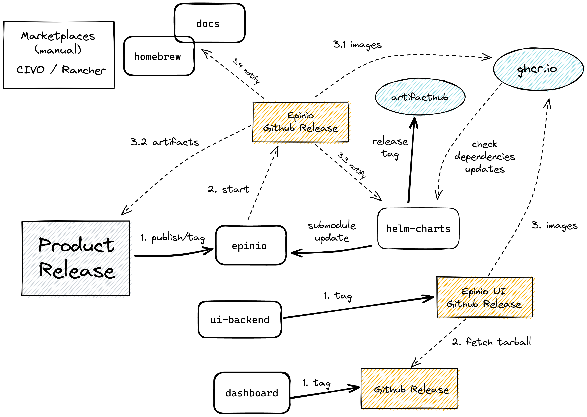
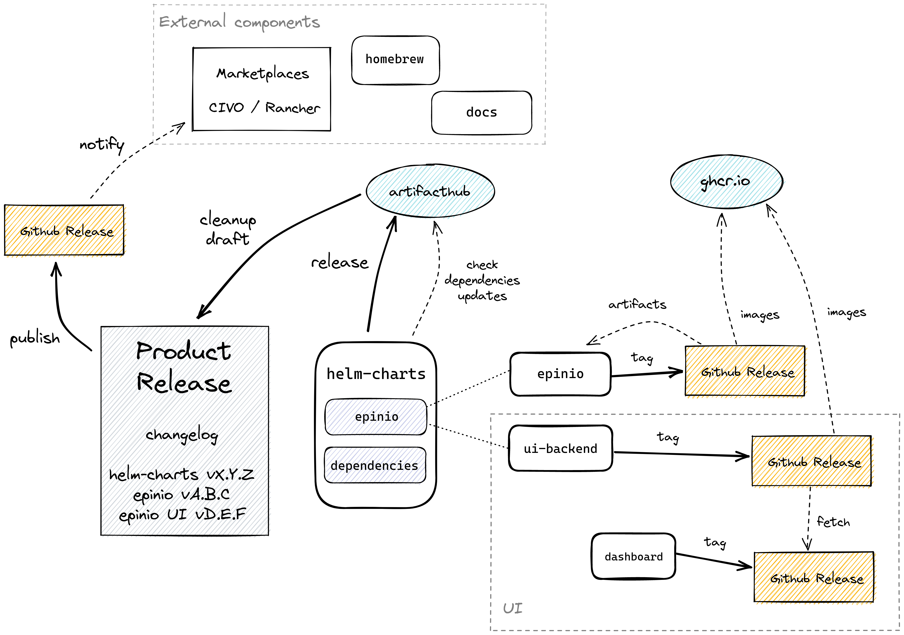

# Epinio release flow

During the last release we have faced some issues, and we would like to have a smoother process.  
This is a RFC to see what could be a better release process.

## Release

We need to clarify what is a release. We can identify different types of releases, but the one that we care the most is probably the **Product Release**. This is what we are showing to our customers.

The **Product Release** should not be tied to a Epinio tag. This is probably the most controversial point and the biggest source of confusion. Epinio is made of different components, and we could decide to make a Product Release without actually bumping the `epinio` server, maybe bumping only a dependency or the UI.

A Product Release should be prepared manually, but an automatically generated draft could be already available.  
Clear titles and labels will be helpful in preparing the draft.  
Everyone should be able to do a release. Ideally most of the steps should be automated. We have prepared an ISSUE_TEMPLATE with a "Release Checklist" that should be easy to follow, highlighting all the steps and useful links.

The Product Release should contain important notes, the changelog with the list of new features, bug fixes and the corresponding links to PRs and issues.
It should also contains references to the Helm Charts, images and binaries previously released and built.

The publishing of the Product Release Notes is a manual step.  

## Current state

Epinio is made up of different components.

The [`epinio/epinio`](https://github.com/epinio/epinio) repository contains the code used to build the binary of the `epinio` CLI and the `epinio-server` image.

The Epinio UI image is made from the [`ui-backend`](https://github.com/epinio/ui-backend) (a proxy for the [`dashboard`](https://github.com/epinio/ui). The dashboard is hosted in the `epinio-dev` branch of the [`rancher/dashboard`](https://github.com/rancher/dashboard) repository.

The [`helm-charts`](https://github.com/epinio/helm-charts) are the suggested and supported way to deploy Epinio. They are wrapping the [`epinio`](https://artifacthub.io/packages/helm/epinio/epinio) charts, the [`epinio-ui`](https://artifacthub.io/packages/helm/epinio/epinio-ui) charts, and the dependencies.

### Release flow

The following diagram is showing the current release flow. The entrypoint is the Product Release. The publishing of the release will tag `epinio` repository triggering a build. This build will prepare the binaries and images. It will also notify external repositories about this new version. Please note that the Epinio Helm Charts are not released yet, and so even if we published a new release it won't be available until we release them.  

Note that the Epinio UI is a chart dependency of the Epinio Helm Chart, and it is following an [independent release](https://github.com/epinio/ui/tree/dev/docs/developer#standalone-1). However since the Product Release is tied to an Epinio release, in order to update the UI we still need to tag `epinio`.

## Proposal

The version of the Product Release could diverge from the `epinio` or `epinio-ui` versions. It could be aligned with the Helm Charts version because they are the way on how we are supporting the Epinio deployment.

Independent releases and tags of the different components should be possible.

This diagram tries to show a cleaner release flow.

The `epinio` and `epinio-ui` components are built from tags, and the two should be completely independent and automated. The new available images should trigger a PR on the Helm Charts. When ready we could manually trigger a Helm Chart release to publish the new charts with the new images. This release could prepare the draft for the Product Release.

After a cleanup of the Product Release we can publish it. This will trigger and notify all the external components about the new available version.
